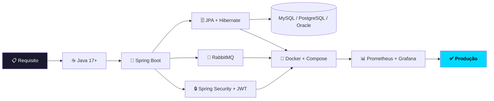

<!-- Header -->
<div align="center">

```
██████╗ ██████╗ ██╗   ██╗███╗   ██╗ ██████╗     ██████╗ ███████╗    ███████╗██████╗  █████╗  ██████╗  █████╗
██╔══██╗██╔══██╗██║   ██║████╗  ██║██╔═══██╗    ██╔══██╗██╔════╝    ██╔════╝██╔══██╗██╔══██╗██╔════╝ ██╔══██╗
██████╔╝██████╔╝██║   ██║██╔██╗ ██║██║   ██║    ██║  ██║█████╗      █████╗  ██████╔╝███████║██║  ███╗███████║
██╔══██╗██╔══██╗██║   ██║██║╚██╗██║██║   ██║    ██║  ██║██╔══╝      ██╔══╝  ██╔══██╗██╔══██║██║   ██║██╔══██║
██████╔╝██║  ██║╚██████╔╝██║ ╚████║╚██████╔╝    ██████╔╝███████╗    ██║     ██║  ██║██║  ██║╚██████╔╝██║  ██║
╚═════╝ ╚═╝  ╚═╝ ╚═════╝ ╚═╝  ╚═══╝ ╚═════╝     ╚═════╝ ╚══════╝    ╚═╝     ╚═╝  ╚═╝╚═╝  ╚═╝ ╚═════╝ ╚═╝  ╚═╝
```


<br/>

[](https://www.linkedin.com/in/bruno-de-fraga-b430aa161/)
[](mailto:brunofragaa97@gmail.com)
[](https://github.com/brunofdev)
[](https://www.brunofragadev.com)
[](https://www.linkedin.com/in/bruno-de-fraga-b430aa161/)
[](https://github.com/brunofdev)

</div>

---

<br/>

## 🎯 O que me diferencia dos outros devs?

> *A maioria dos devs escreve código que funciona.*
> *Eu escrevo código que **outras pessoas conseguem manter.***

Não sou só mais um dev que sabe fazer um CRUD. Sou alguém que **pensa no problema antes de abrir o editor**, que questiona arquitetura antes de escrever a primeira linha, e que perde o sono quando um serviço em produção tem latência alta.

```
Problema complexo  →  Solução simples  →  Código limpo  →  Produção estável
       🔴                   🟡                  🟢               🚀
```

<br/>

---

## 💼 Em números

<div align="center">

| 🏗️ Projetos no GitHub | ☕ Stack Principal | 🗄️ Bancos Dominados | 📍 Localização | 🌐 Regime |
|:---:|:---:|:---:|:---:|:---:|
| **3+** | **Java · Spring Boot · SQL** | **MySQL · PostgreSQL · Oracle** | **Florianópolis/SC 🇧🇷** | **Presencial, Remoto ou Híbrido** |

</div>

<br/>

---

## 🧠 Stack — do conceito ao deploy



<div align="center">

### Tecnologias que uso **de verdade** — não só no LinkedIn


</div>

<br/>

---

##  Projetos 

<!-- ===================================================== -->
<!--                   DESTAQUE PRINCIPAL                  -->
<!-- ===================================================== -->

<div align="center">

### ⭐ Projeto em Destaque

</div>

<table>
<tr>
<td>

<div align="center">

[](https://www.brunofragadev.com)
&nbsp;
[](https://github.com/brunofdev/brunofragadev-api)
&nbsp;
[](https://www.brunofragadev.com/swagger-ui.html)

</div>

<br/>

### 🌐 BrunoFragaDev — Portfolio API
**O backend de produção da minha própria plataforma. Código real, problema real, solução real.**

API RESTful responsável por toda a infraestrutura de **[brunofragadev.com](https://www.brunofragadev.com)**: autenticação completa, gerenciamento de portfólio e coleta de feedbacks de usuários reais. Um sistema que simula — e entrega — o que uma aplicação de produção exige.

<br/>

<details>
<summary><b>🏗️ Arquitetura & Decisões Técnicas</b></summary>

<br/>

O projeto segue **Clean Architecture + DDD**, dividido em camadas com responsabilidades bem definidas:

```
┌─────────────────────────────────────────┐
│         API / Controllers               │  ← Entrada HTTP, validação de DTOs
├─────────────────────────────────────────┤
│         Application (Use Cases)         │  ← Orquestração das regras de negócio
├─────────────────────────────────────────┤
│         Domain (Entities + Exceptions)  │  ← Núcleo isolado, sem frameworks
├─────────────────────────────────────────┤
│         Infrastructure                  │  ← JPA, Security, E-mail, Handlers
└─────────────────────────────────────────┘
```

**Por que Use Cases ao invés de Services?**
Cada caso de uso resolve **um único problema** — `RegisterUserUseCase`, `ActivateAccountUseCase`, `ProcessGoogleLoginUseCase`. Sem "God Classes". Máxima testabilidade e legibilidade.

**Por que JWT stateless?**
Escalabilidade horizontal. Qualquer instância valida o token sem depender de sessão centralizada.

**Por que RBAC hierárquico?**
Roles acumulativas com 4 níveis — `USER → ADMIN1 → ADMIN2 → ADMIN3` — onde cada nível herda as permissões do anterior.

</details>

<details>
<summary><b>⚙️ O que este sistema faz</b></summary>

<br/>

**🔐 Auth & Segurança**
- Autenticação via credenciais com geração de token JWT
- Login social via Google OAuth2
- RBAC com 4 níveis hierárquicos de acesso
- Recuperação de senha com código de segurança de 6 dígitos

**👤 Usuários**
- Cadastro com status pendente e ativação via código enviado por e-mail
- Edição completa de perfil (bio, links GitHub/LinkedIn, profissão, cidade)
- Modo anônimo — controle de visibilidade do perfil

**📁 Portfólio**
- CRUD completo de projetos com galeria de imagens, ficha técnica e guia de setup
- Passos de configuração sequenciais com comandos de terminal

**💬 Feedbacks**
- Avaliações (1–5) vinculadas à plataforma ou a projetos específicos
- Notificação automática para o admin a cada novo feedback
- Submissão anônima opcional

**🛠️ Infra**
- Auditoria automática de criação/modificação dos registros
- Tratamento centralizado de exceções com respostas padronizadas
- Documentação interativa via Swagger UI / OpenAPI

</details>

<br/>

<div align="center">


<br/>

[](https://github.com/brunofdev/brunofragadev-api)

</div>

</td>
</tr>
</table>

<br/>

---

<!-- ===================================================== -->
<!--                   OUTROS PROJETOS                     -->
<!-- ===================================================== -->

<div align="center">

### 📂 Outros Projetos

</div>

<table>
<tr>
<td width="55%">

### 🔀 Portfolio Microservices
**O projeto que me custou mais noites de estudo — e valeu cada uma.**

Sistema completo de gerenciamento de website construído com **arquitetura de microsserviços real**: serviços independentes, comunicação assíncrona, autenticação centralizada e observabilidade completa.

**Destaques técnicos:**
- 🔀 Microsserviços desacoplados com Spring Cloud
- 📨 Mensageria assíncrona com RabbitMQ
- 🔒 Autenticação JWT em gateway centralizado
- 📊 Monitoramento com Prometheus + Grafana
- 🐳 Ambiente completo em Docker Compose

</td>
<td width="45%" align="center">

[](https://github.com/brunofdev/portfolio-microservices.git)


</td>
</tr>

<tr>
<td width="55%">

### 🍽️ Sistema de Restaurante API
**REST API completa, do cardápio ao pedido entregue.**

Backend robusto para gestão total de restaurante com segurança JWT, arquitetura em camadas e código que qualquer dev consegue evoluir.

**Destaques técnicos:**
- 🍕 CRUD completo de cardápio e produtos
- 🛒 Gestão de pedidos com status em tempo real
- 🔒 Autenticação e autorização com JWT
- 🏛️ Arquitetura limpa com separação de responsabilidades
- 📖 Endpoints documentados e testados no Postman

</td>
<td width="45%" align="center">

[](https://github.com/brunofdev/sistema-restaurante-api)


</td>
</tr>

<tr>
<td width="55%">

### 📊 Relatórios Corporativos PL/SQL
**SQL que vai muito além do SELECT * FROM tabela.**

Queries, stored procedures e relatórios corporativos reais em PL/SQL Oracle. CTEs complexas, tuning de performance e iReport — o tipo de SQL que você encontra em empresa grande.

**Destaques técnicos:**
- 📈 Relatórios gerenciais com iReport
- ⚡ SQL Tuning e otimização de queries lentas
- 🔁 Stored Procedures e Functions reutilizáveis
- 🧩 CTEs e subqueries para lógicas complexas

</td>
<td width="45%" align="center">

[](https://github.com/brunofdev/PL-SQL---Trabalhos-Feitos)


</td>
</tr>
</table>

<br/>

---

## 📈 GitHub Stats

<div align="center">


<br/>


<br/>


</div>

<br/>

---

## 📚 Roadmap de Estudos

```java
// O que estou construindo hoje — e onde quero chegar
Map<String, String> roadmap = new LinkedHashMap<>();

// Fundação sólida — já está no código
roadmap.put("Clean Architecture + DDD",    "✅ Aplicado em producao real (brunofragadev-api)");
roadmap.put("SOLID + Design Patterns",     "✅ Aplicando em projetos reais");
roadmap.put("OAuth2 + JWT avancado",       "✅ Implementado e documentado");
roadmap.put("SQL Tuning + CTEs Oracle",    "✅ Repositorio dedicado");

// Em andamento — você vai ver no próximo commit
roadmap.put("Microsservicos Spring Cloud", "🔄 Aprofundando resiliencia e circuit breaker");
roadmap.put("Event-Driven + RabbitMQ",    "🔄 Em uso ativo no portfolio");
roadmap.put("Docker + CI/CD pipelines",   "🔄 Automatizando deploys");

// Próximos passos — com data marcada
roadmap.put("Testes com JUnit + Mockito", "📌 Proximo projeto ja nasce com testes");
roadmap.put("Kubernetes basico",          "📌 Apos dominar CI/CD");
```

<br/>

---

<div align="center">

<table>
<tr>
<td align="center" width="50%">

### 💡 Hard Skills
✅ APIs REST robustas com Spring Boot  
✅ Clean Architecture + DDD em produção  
✅ Autenticação completa: JWT + Google OAuth2  
✅ Microsserviços reais com Spring Cloud  
✅ Mensageria assíncrona com RabbitMQ  
✅ Banco de dados além do ORM — PL/SQL real  
✅ Observabilidade com Prometheus + Grafana  
✅ Containers e orquestração com Docker  

</td>
<td align="center" width="50%">

### 🧠 Soft Skills
✅ Pensa antes de codar — arquitetura importa  
✅ Código documentado, não só funcional  
✅ Autonomia sem perder comunicação  
✅ Aprende rápido — esse GitHub prova ↑  
✅ Não some quando o bug é difícil  
✅ Aberto a feedback e melhoria contínua  

</td>
</tr>
</table>

<br/>

### **Se você leu até aqui — a gente precisa conversar.**

<br/>

[](https://www.linkedin.com/in/bruno-de-fraga-b430aa161/)
[](mailto:brunofragaa97@gmail.com)
[](https://www.brunofragadev.com)

<br/>

> *"Não contrate um dev que sabe tudo.*
> *Contrate um dev que aprende rápido, entrega com qualidade*
> *— e não some quando aparece um bug difícil em produção."*

</div>

<br/>


